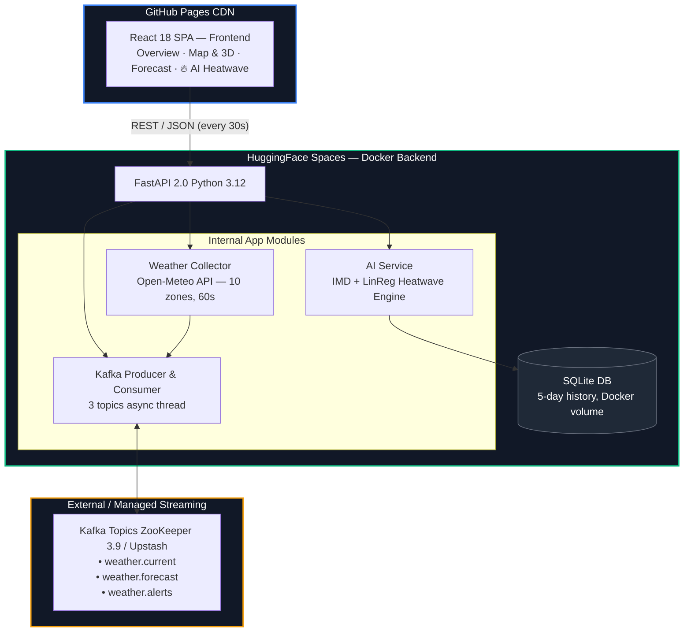

# 🌡️ Nagpur Weather Monitor v4

> Fine-grained, multi-zone weather monitoring for Nagpur with **Apache Kafka + ZooKeeper**, an **AI Heatwave Engine** (IMD criteria + weighted linear regression), and a **3D React frontend**.

[](https://github.com)
[](https://huggingface.co)
[](https://fastapi.tiangolo.com)
[](https://react.dev)
[](https://kafka.apache.org)

---

## 📑 Table of Contents

- [Architecture](#-architecture)
- [Features](#-features)
- [AI Heatwave Engine](#-ai-heatwave-engine)
- [Kafka Topics](#-kafka-topics)
- [Monitored Zones](#-monitored-zones)
- [Tech Stack](#-tech-stack)
- [Quick Start (Local)](#-quick-start-local)
- [Cloud Deployment](#-cloud-deployment)
- [Project Structure](#-project-structure)
- [API Endpoints](#-api-endpoints)
- [Known Challenges & Solutions](#-known-challenges--solutions)
- [Roadmap](#-roadmap)
- [Author](#-author)

---

## 🏗️ Architecture



---

## ✨ Features

| Tab | What you get |
|---|---|
| **Overview** | 7 live KPI cards (Avg/Max Temp, Humidity, Rain, Wind, AQI, Zones) + zone comparison chart + 48h forecast |
| **Map & 3D** | Leaflet heatmap (temp/humidity/rain modes) + Three.js drag-to-rotate 3D heatwave bars side-by-side |
| **Forecast** | 48h temperature/humidity area chart + precipitation probability + rain volume |
| **🔥 AI Heatwave** | IMD-classified current status + 5-day zone history + tomorrow's prediction with confidence level |

A **real-time alert ticker** scrolls Kafka-sourced threshold alerts (`heat_wave`, `heavy_rain`, etc.) across the top of the UI.

---

## 🤖 AI Heatwave Engine

### Detection — IMD Official Criteria

| Level | Condition |
|---|---|
| 🟢 **Normal** | Max temp < 40°C |
| 🟡 **Watch** | Max temp ≥ 40°C |
| 🟠 **Heatwave** | Max temp ≥ 40°C AND departure from normal ≥ 4.5°C |
| 🔴 **Severe Heatwave** | Max temp ≥ 45°C OR departure ≥ 6.5°C |
| ⛔ **Extreme** | Max temp ≥ 47°C |

### Prediction — Weighted Linear Regression

- Aggregates 5-day zone-level daily max temperatures from SQLite
- Applies exponential weights `e^(0.4 × day_index)` so recent days dominate the trend
- Predicts tomorrow's city max and classifies it using IMD criteria
- Falls back to IMD monthly climatological normals when data is insufficient

### Monthly Normal Reference (Nagpur)

| Jan | Feb | Mar | Apr | May | Jun | Jul | Aug | Sep | Oct | Nov | Dec |
|---|---|---|---|---|---|---|---|---|---|---|---|
| 29°C | 32°C | 37°C | 41°C | 43°C | 38°C | 31°C | 30°C | 32°C | 35°C | 31°C | 29°C |

---

## 📡 Kafka Topics

| Topic | Frequency | Content |
|---|---|---|
| `weather.current` | Every 60s | Per-zone readings (temp, humidity, wind, AQI, rain) |
| `weather.forecast` | Every 60s | 48-hour hourly forecast bundle |
| `weather.alerts` | On threshold breach | `heat_wave`, `heavy_rain`, `high_wind`, `poor_aqi` |

| Service | Port |
|---|---|
| ZooKeeper | `2181` |
| Kafka Broker | `9092` |
| Kafka UI | `8080` *(local only)* |

---

## 🗺️ Monitored Zones — Nagpur

10 zones with individual lat/lon coordinates:

> Sitabuldi · Dharampeth · Sadar · Nagpur Airport · Hingna · Kamptee · Butibori · Wadi · Manewada · Wardha Road

---

## 🛠️ Tech Stack

| Layer | Technology |
|---|---|
| **Frontend** | React 18, Three.js / @react-three/fiber, Recharts, Leaflet, Framer Motion |
| **Backend** | Python 3.12, FastAPI 2.0, APScheduler |
| **Streaming** | Apache Kafka 3.6 + ZooKeeper 3.9 (Bitnami) |
| **AI** | Weighted linear regression (NumPy) + IMD classification |
| **Storage** | SQLite (Docker named volume — persists across restarts) |
| **Weather API** | Open-Meteo (Current + 48h Forecast + AQI) |
| **Deployment** | HuggingFace Spaces (backend) + GitHub Pages (frontend) |
| **CI/CD** | GitHub Actions → auto-deploys to `gh-pages` branch on push to `main` |

---

## 🚀 Quick Start (Local)

```bash
git clone https://github.com/Mangesh46/nagpur-weather-monitor
cd nagpur-weather-monitor

# 1. Copy env file — no API key needed (Open-Meteo is free & keyless)
cp .env.example .env
nano .env   # only set KAFKA_BOOTSTRAP_SERVERS if using Upstash

# 2. Start ZooKeeper + Kafka + Backend
docker compose up -d

# 3. Start React frontend (dev mode)
docker compose --profile dev up frontend
```

Open `http://localhost:3000` — Kafka UI available at `http://localhost:8080`

---

## ☁️ Cloud Deployment

### Backend — HuggingFace Spaces

1. Create a new **Docker** Space on [huggingface.co](https://huggingface.co)
2. Push the contents of `./backend/` to the Space repo
3. Set the following Space secrets:

| Secret | Value |
|---|---|
| `KAFKA_BOOTSTRAP_SERVERS` | Upstash Kafka endpoint |
| `PORT` | `7860` |

> **Why Upstash?** HuggingFace Spaces runs a single Docker container, so it cannot host ZooKeeper + Kafka alongside FastAPI. Upstash provides managed Kafka on a free tier that works seamlessly here. 

### Frontend — GitHub Pages

Add these secrets to your GitHub repository:

| Secret | Value |
|---|---|
| `REACT_APP_BACKEND_URL` | `https://YOUR_HF_USER-nagpur-weather.hf.space` |

Push to `main` → GitHub Actions builds and deploys to the `gh-pages` branch automatically. Set repo **Pages source** to the `gh-pages` branch.

---

## 📂 Project Structure

```
nagpur-redesign/
├── frontend/
│   ├── src/
│   │   ├── App.jsx                      # Main SPA shell, 4-tab layout
│   │   ├── components/
│   │   │   ├── AlertTicker.jsx          # Scrolling Kafka alert bar
│   │   │   ├── NagpurMap.jsx            # Leaflet heatmap (3 modes)
│   │   │   ├── HeatwaveIntensity3D.jsx  # Three.js / R3F 3D bars
│   │   │   ├── ForecastCharts.jsx       # Recharts temperature/zone charts
│   │   │   ├── PrecipitationViz.jsx     # Rain probability chart
│   │   │   └── AiHeatwavePanel.jsx      # IMD status + prediction panel
│   │   └── hooks/
│   │       └── useWeatherData.js        # Polling hook + state management
│   └── package.json
├── backend/
│   ├── main.py                          # FastAPI app, lifespan, all endpoints
│   ├── weather_service.py               # Open-Meteo fetcher (10 zones async)
│   ├── kafka_producer.py                # Publishes to 3 Kafka topics
│   ├── kafka_consumer.py                # Background consumer thread
│   ├── ai_service.py                    # IMD classification + LinReg prediction
│   ├── history_store.py                 # SQLite CRUD for 5-day temperature history
│   ├── config.py                        # Settings via env vars
│   ├── Dockerfile                       # Auto-adapts PORT for HF Spaces
│   └── requirements.txt
├── docker-compose.yml                   # ZooKeeper + Kafka + Backend + Frontend
├── .env.example
└── .github/workflows/deploy.yml         # GitHub Actions CI/CD
```

---

## 🔌 API Endpoints

| Method | Endpoint | Description |
|---|---|---|
| `GET` | `/health` | Health check |
| `GET` | `/api/current` | All 10 zones — current weather |
| `GET` | `/api/current/{zone}` | Single zone data |
| `GET` | `/api/forecast` | 48-hour hourly forecast |
| `GET` | `/api/alerts` | Recent threshold alerts |
| `GET` | `/api/heatmap` | Lat/lon + metrics for map overlay |
| `GET` | `/api/ai/heatwave` | AI status, prediction, 5-day history |
| `GET` | `/api/ai/zones-history` | Per-zone daily max temperature history |
| `POST` | `/api/refresh` | Force immediate weather poll |

---

## ⚠️ Known Challenges & Solutions

| Challenge | Solution |
|---|---|
| Kafka can't run inside HF Spaces | Upstash managed Kafka via `KAFKA_BOOTSTRAP_SERVERS` env var |
| CORS between GitHub Pages and HF Spaces | `CORSMiddleware` with comma-delimited `allow_origins` from env |
| SQLite lost on container restart | Docker named volume persists DB across restarts |
| AI accuracy with sparse data | Exponential-weighted LinReg; falls back to IMD monthly normals |
| Three.js blocking initial load | `React.lazy()` + `Suspense` defers 3D bundle to Map tab activation |

---

## 🗺️ Roadmap

- [ ] **Phase 2** — LSTM / ARIMA models for improved heatwave prediction
- [ ] **Phase 2** — Firebase Cloud Messaging push notifications
- [ ] **Phase 3** — Multi-city expansion (Chandrapur, Amravati, Akola)
- [ ] **Phase 3** — CSV/JSON historical export + Grafana/InfluxDB integration
- [ ] **Phase 4** — ONNX Runtime Web for offline browser-side inference
- [ ] **Phase 4** — Official IMD AWS feeds + CPCB AQI stream integration

---

## 👤 Author

**Mangesh Sarde** — RKNEC, Electronics & Communications Engineering, Sem VI

- 🐙 GitHub: [github.com/Mangesh46](https://github.com/Mangesh46)
- 💼 LinkedIn: [linkedin.com/in/mangesh-sarde](https://linkedin.com/in/mangesh-sarde)
- 📧 Email: mangeshsarde6@gmail.com

---

*Nagpur Weather Monitor v4 · Kafka · FastAPI · React 18 · Three.js · AI Heatwave · IMD Criteria*
